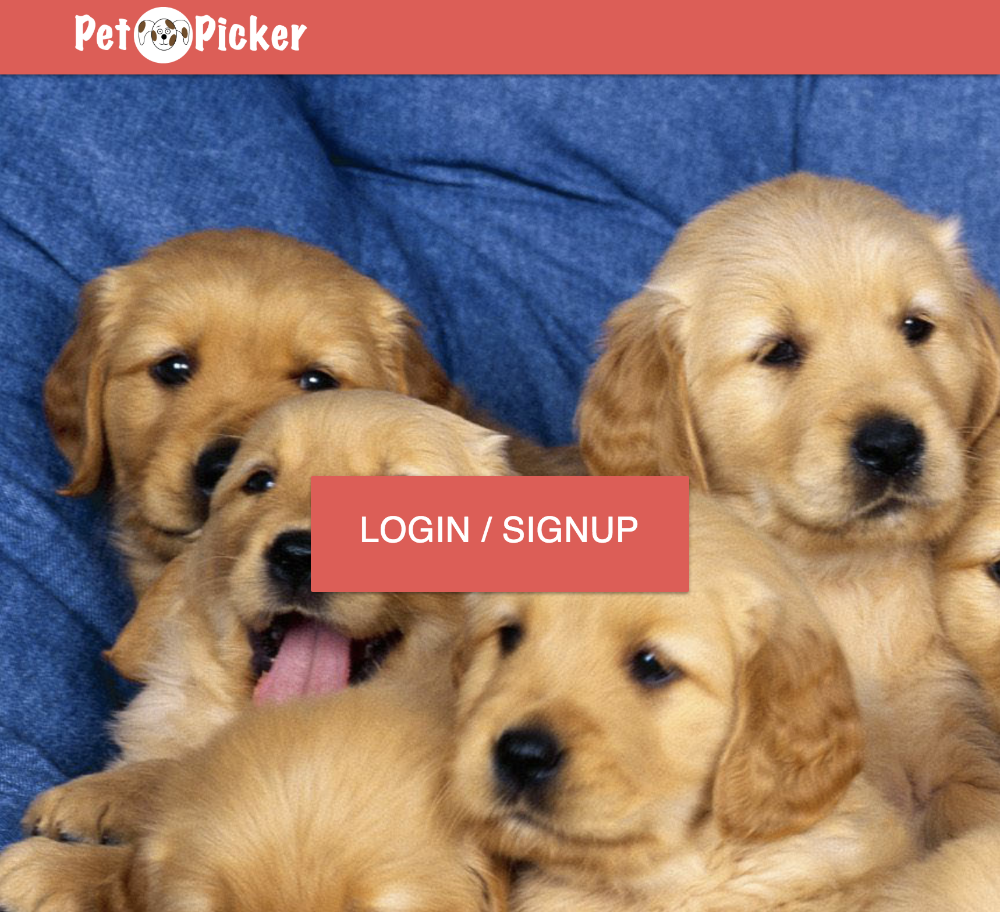

# PetPicker



Pet Picker is a single page app that allows a user to browse pets that are available for adoption.  Upon signing in, if a user is an adopter, user will be routed to view pets, where she can like or nope the pet.  An owner, when signed in, can view the adopters who have liked her pet.  An owner may click on a particular person who has liked her pet and create a match which can then be viewd by an adopter in the matches view.  


## Getting Started

These instructions will get you a copy of the project up and running on your local machine for development and testing purposes. See deployment for notes on how to deploy the project on a live system.

### Prerequisites
Be sure you have node.
```
node -v
```
If you do not have node, visit [Node.js](https://nodejs.org/en/) in order to download it and npm.  Then update your npm by running

```
npm install npm@latest -g
```

Be sure you have npm.
```
npm -v
```

### Installing

Clone down the repository at https://github.com/tmcjunkinmarquis/PetPicker.

From the terminal run each of the following commands:

```
git clone https://github.com/tmcjunkinmarquis/PetPicker.git
cd pet-picker-app
npm install
npm start
```
'npm start' runs the app in the development mode.<br>
Open [http://localhost:3000](http://localhost:3000) to view it in the browser.

For the project to build, **these files must exist with exact filenames**:

* `public/index.html` is the page template;
* `src/index.js` is the JavaScript entry point.

```
my-app/
  README.md
  node_modules/
  package.json
  public/
    index.html
    favicon.ico
  src/
    App.css
    App.js
    App.test.js
    index.css
    index.js
    localStorage.js
```

You can delete or rename the other files.

You may create subdirectories inside `src`. For faster rebuilds, only files inside `src` are processed by Webpack.<br>
You need to **put any JS and CSS files inside `src`**, otherwise Webpack won’t see them.
A step by step series of examples that tell you have to get a development env running


## Running the tests

```
npm test
```
In order to see the test coverage:

```
npm test -- --coverage -u
```

## Deployment

This app is deployed at (https://pet-picker.herokuapp.com/)[https://pet-picker.herokuapp.com/]

## Built With

This project was bootstrapped with [Create React App](https://github.com/facebookincubator/create-react-app).

* [JavaScript](https://www.javascript.com/) - Programming language
* [React](https://reactjs.org/) - JavaScript library
* npm - Module management


## Authors

* **Steve Schwedt** - *Initial work* - [Github](https://github.com/apoc64)
* **Theresa Marquis** - *Initial work* - [Github](https://github.com/tmcjunkinmarquis)
* **Tyler Westlie** - *Initial work* - [Github](https://github.com/tywestlie)


## Acknowledgments
